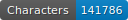
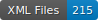

# Documents  Artlas

<br/>

    

Swiss (German and French) art catalogues of the 19th c.

## Note on the data

```diff
- WARNING: There is no training data for layout analysis: only for HTR.
```

## Content

Catalogues from Swiss art exhibitions from the _Turnus_ period (1842-1961) published by the _Société suisse des beaux-arts_ (SSBA). More information on the website of the [SIK-ISEA](https://www.sik-isea.ch/fr-ch/Archives-de-lart-biblioth%C3%A8que/Biblioth%C3%A8que/Fonds-num%C3%A9riques/Catalogue-des-Turnus).

These data are part of the [Artl@s](https://artlas.huma-num.fr/fr/) project.

| Language | Date | City       | Transcription          |
|----------|------|------------|------------------------|
| French   | 1884 | Lausanne   | Martina Rizzello       |
| French   | 1886 | Le Locle   | Stefania Tesser        |
| German   | 1852 | Basel      | Martina Rizzello       |
| German   | 1874 | Aarau      | Béatrice Joyeux-Prunel |
| German   | 1880 | Bern       | Valery Berlincourt     |
| German   | 1884 | Basel      | Guillaume Aebi         |
| German   | 1886 | Basel      | Raoul Bickel           |
| German   | 1886 | Bern       | Gabriella Lini         |
| German   | 1886 | Zürich     | Marie Jeannot-Tirole   |
| German   | 1887 | Konstanz   | Victoria Bukvic        |
| German   | 1887 | St Gallen  | Valery Berlincourt     |
| German   | 1887 | Winterthur | Elena Rizzi            |
| German   | 1887 | Zürich     | Jaime Diaz             |
| German   | 1890 | Basel      | Marie Jeannot-Tirole   |

Heavy correction has been done by S. Gabay.

## How to cite

Cf. [htr-united.yml](https://github.com/FoNDUE-HTR/FONDUE-MLT-ART/blob/main/htr-united.yml) file.

## Licence

The catalogues are in the public domain, images are made available by [SIK-ISEA](https://www.sik-isea.ch/fr-ch/Archives-de-lart-biblioth%C3%A8que/Biblioth%C3%A8que/Fonds-num%C3%A9riques/Catalogue-des-Turnus) and transcriptions are [CC-BY](https://creativecommons.org/licenses/by/2.0/fr/).

<a rel="license" href="https://creativecommons.org/licenses/by/2.0"></a><br />