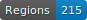

# Documents  Artlas

 

    

## Description

Catalogues from Swiss art exhibitions from the _Turnus_ period (1842-1961) published by the _ Société suisse des beaux-arts_ (SSBA). More information on the website of the [SIK-ISEA](https://www.sik-isea.ch/fr-ch/Archives-de-lart-biblioth%C3%A8que/Biblioth%C3%A8que/Fonds-num%C3%A9riques/Catalogue-des-Turnus).

These data are part of the [Artl@s](https://artlas.huma-num.fr/fr/) project. 

## Note on the data

There is no training data for layout analysis: only for HTR.

## Credits 

Béatrice Joyeux-Prunel, Valéry Berlincourt, Marie Jeannot-Tirole

## Licence

The catalogues are in the public domain, images are made available by [SIK-ISEA](https://www.sik-isea.ch/fr-ch/Archives-de-lart-biblioth%C3%A8que/Biblioth%C3%A8que/Fonds-num%C3%A9riques/Catalogue-des-Turnus) and transcriptions are [CC-BY](https://creativecommons.org/licenses/by/2.0/fr/).

## Cite this repository

Béatrice Joyeux-Prunel, Valéry Berlincourt, Marie Jeannot-Tirole, _Turnus Catalogues: Groundtruth for the HTR_, Université de Genève, 2022.